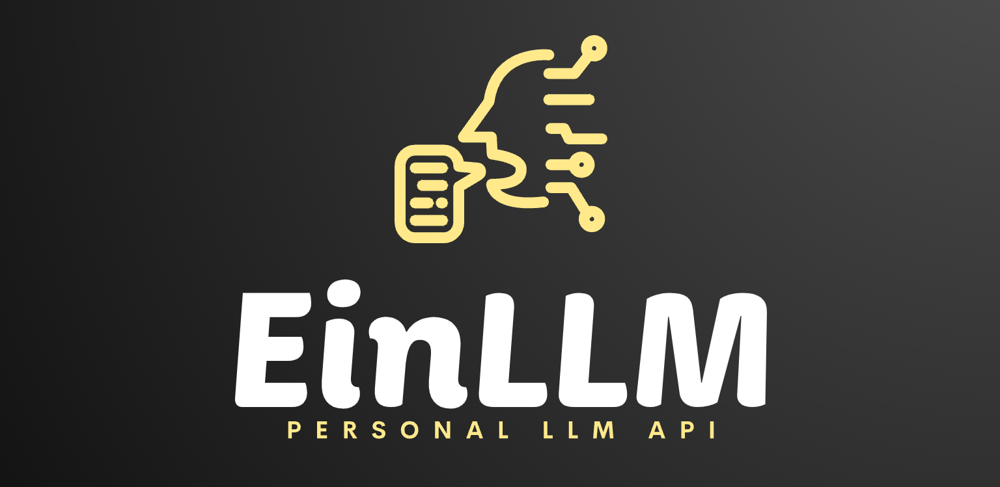

# EinLLM




> Llama2 Self-hosted Chatbot API

This repository contains a FastAPI application that serves as a local personal chatbot API. It allows you to interact with the Llama2 LLM (and other open-source LLMs) to have natural language conversations, generate text, and perform various language-related tasks.

## Features

- Chat with the Llama2 LLM or other open-source LLMs.
- Perform text generation, translation, and more.
- Customizable and extendable for your specific needs.

## Installation

1. Clone this repository to your local machine:

   ```shell
   git clone https://github.com/ehsanghaffar/llama2-fastapi-chatbot.git
   ```

2. Change the working directory to the project folder:

   ```shell
   cd llama2-fastapi-chatbot
   ```

3. Install the required dependencies:

   ```shell
   pip install -r requirements.txt
   ```

> Do'nt forget move your Llama2 model to `/static` directory

## Usage

1. Run the FastAPI application:

   ```shell
   uvicorn main:app --reload
   ```

2. Access the API at `http://localhost:8000` in your web browser or through API client tools like `curl`, `httpie`, or Postman.

## Using Docker

```shell
docker build -t llm .

docker run -d -p 8800:8000 --name llm_app llm
```

## API Endpoints

- `/chatting`: Start a chat session with the LLM.
<!-- - `/generate`: Generate text based on specific prompts. -->
<!-- - `/translate`: Translate text between languages. -->

For detailed usage examples, refer to the documentation.

## Documentation

[Link to detailed API documentation goes here]

## Configuration

- You can customize the behavior and settings of the LLM in the `config.py` file.

## Contributing

We welcome contributions to enhance the functionality of this FastAPI chatbot API. Feel free to submit issues, feature requests, or pull requests.

## License

This project is licensed under the [MIT License](LICENSE).

## Acknowledgments

- Acknowledgments or credits to the Llama2 LLM and any other open-source LLMs used in this project.

## Contact

For questions or feedback, please contact [Ehsan Ghaffar](mailto:ghafari.5000@gmail.com)
